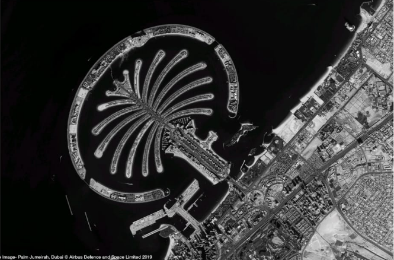
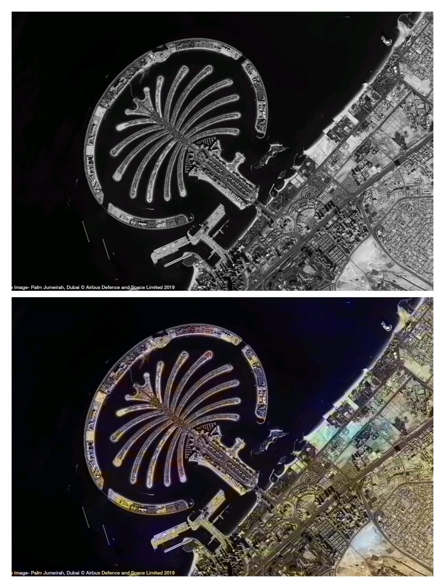

# 🌍 SAR Image Colorization for Comprehensive Insight  
###                                         using Deep Learning Model  

---

## 📌 Project Overview

Synthetic Aperture Radar (SAR) images are captured in grayscale format and lack visual interpretability compared to optical images. This project presents a **Deep Learning-based SAR Image Colorization system** that enhances grayscale SAR images into realistic color representations using Convolutional Neural Networks (CNN).

The system improves visualization, interpretation, and analytical insight of satellite imagery for applications such as:

- 🌊 Water body detection  
- 🏙 Urban area mapping  
- 🌾 Agricultural monitoring  
- 🛰 Remote sensing analysis  
- 🛡 Defense & surveillance  

---

## 🧠 Problem Statement

SAR images are highly informative but difficult to interpret visually because they are grayscale and contain speckle noise. Manual analysis requires expertise.

👉 Our solution automatically colorizes SAR images using a Deep Learning model to enhance interpretability and visual clarity.

---

## 🚀 Proposed Solution

We implemented a Deep Learning-based colorization model that:

1. Accepts grayscale SAR images  
2. Extracts spatial and texture features using CNN  
3. Predicts chrominance (color) components  
4. Reconstructs a colorized SAR image  
5. Provides improved visual insight for analysis  

---

## 🏗 System Architecture

```
Input SAR Image (Grayscale)
          │
          ▼
Preprocessing (Resize, Normalize)
          │
          ▼
Deep Learning Model (CNN)
          │
          ▼
Color Prediction (a*b channels)
          │
          ▼
Reconstruction (LAB → RGB)
          │
          ▼
Colorized SAR Image (Output)
```

---

## 📊 ER Diagram (Conceptual)

```
Dataset
│
├── SAR Image
│      ├── Image_ID
│      ├── Path
│      ├── Resolution
│
└── Optical Image
       ├── Image_ID
       ├── Path
       ├── Corresponding_SAR_ID
```

---

## 🛠 Technologies Used

| Technology | Purpose |
|------------|----------|
| Python | Core programming language |
| OpenCV | Image processing |
| NumPy | Numerical computation |
| TensorFlow / Keras | Deep Learning framework |
| Matplotlib | Visualization |
| Jupyter Notebook | Model experimentation |
| CNN Architecture | Image feature extraction |

---

## 📁 Project Structure

```
SAR-Image-Colorization/
│
├── models/
├── images/
├── output/
├── assets/                     
│    ├── grayscale_input.png
│    ├── colorized_output.png
│    └── comparison.png
│
├── app.py
├── image_colorization.py
├── GUI.py
├── requirements.txt
└── README.md
```

---

## 🖼 Results

### 🔹 Grayscale SAR Image

<p align="center">
  
</p>

---

### 🔹 Colorized Output

<p align="center">
  
</p>

---

### 🔹 Before vs After Comparison

<p align="center">
  
</p>

---

## ⚙ Installation & Setup Guide

### Step 1: Clone Repository

```bash
git clone https://github.com/yourusername/SAR-Image-Colorization.git
cd SAR-Image-Colorization
```

### Step 2: Install Dependencies

```bash
pip install -r requirements.txt
```

### Step 3: Run Application

```bash
python app.py
```

OR

```bash
python image_colorization.py
```

---

## 📈 Model Working

- Converts RGB → LAB color space  
- Uses L channel as input  
- CNN predicts a*b channels  
- Reconstructs LAB → RGB image  
- Generates enhanced color output  

---

## 🔬 Applications

- Remote sensing  
- Environmental monitoring  
- Smart agriculture  
- Urban planning  
- Defense surveillance  
- Disaster assessment  

---

## 📚 Research Contribution

This project is developed as a **research-oriented group project** focusing on deep learning-based SAR image enhancement.

---

## 👨‍💻 Project Team

**Under the Guidance of:**

Prof. P. D. Lanjewar  
Assistant Professor, Department of AIML  
R C Patel Institute of Technology  
Shirpur, Maharashtra  

---

### 👩‍💻 Student Contributors

- Dipali Mali  
- Neha Gayakawad  
- Bhavesh Patil  
- Gaurang Mali  
- Kalpesh Mahajan  

---

## 📌 Future Enhancements

- U-Net architecture implementation  
- GAN-based colorization  
- Attention mechanism integration  
- Real-time web deployment  
- Performance benchmarking with PSNR & SSIM  

---

## 📄 License

This project is developed for academic and research purposes.

---

⭐ If you found this project helpful, please consider giving it a star!
