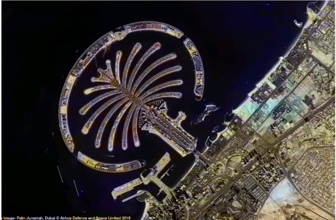

<h1 align="center">🛰 SAR Image Colorization Using Deep Learning</h1>
<h3 align="center">Enhancing Grayscale Synthetic Aperture Radar Images using CNN & OpenCV</h3>

---

## 🚀 Project Overview

This project presents a deep learning-based framework for converting grayscale Synthetic Aperture Radar (SAR) images into visually enhanced color representations using pretrained convolutional neural networks.

The system improves interpretability of radar imagery for remote sensing and satellite analysis applications.

---

# 🛠️ Tech Stack

<p align="center">


</p>

---

# 🎯 Objectives

- Convert grayscale SAR images into colorized representations  
- Improve human interpretability of radar imagery  
- Implement pretrained CNN-based colorization models  
- Provide GUI-based interface for image enhancement  

---

# 🧠 Methodology

1. Load grayscale SAR image  
2. Resize & normalize input  
3. Convert to LAB color space  
4. Feed L-channel into pretrained CNN model  
5. Predict AB color channels  
6. Merge L + AB channels  
7. Convert LAB → BGR  
8. Generate final colorized output  

---

# 🏗 System Architecture

```
Input SAR Image
        ↓
Preprocessing
        ↓
Pretrained CNN Model
        ↓
Color Cluster Mapping
        ↓
LAB to BGR Conversion
        ↓
Final Colorized Output
```

Architecture Type: Deep Learning + Computer Vision Pipeline

---

# 📸 Results

## 🔹 Original Grayscale SAR Image

<p align="center">

</p>

---

## 🔹 Colorized Output Image

<p align="center">

</p>

---

## 🔹 Before vs After Comparison

<p align="center">

</p>

---

# 📂 Project Structure

```
SAR-Image-Colorization/
│
├── models/
├── src/
├── notebooks/
├── sample_inputs/
├── results/
├── research-paper/
├── requirements.txt
└── README.md
```

---

# ⚙ Installation Guide

```bash
git clone https://github.com/your-username/SAR-Image-Colorization-DeepLearning.git
cd SAR-Image-Colorization
pip install -r requirements.txt
```

Run:

```bash
python src/gui.py
```

---

# 🌍 Applications

- Remote Sensing
- Satellite Image Analysis
- Defense & Surveillance
- Urban Planning
- Disaster Monitoring

---

# 🚀 Future Improvements

- U-Net based training approach  
- GAN-based SAR-to-Optical translation  
- PSNR & SSIM evaluation metrics  
- Real-time web deployment  

---

# 👩‍💻 Developed By

Dipali Mali & Team  
Final Year Computer Science Engineering  

---

⭐ If you found this project useful, please give it a ⭐ on GitHub!
